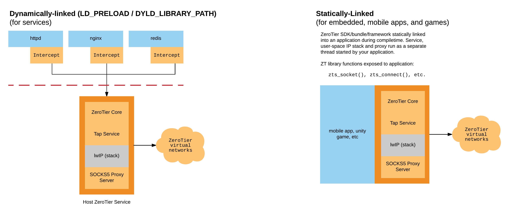
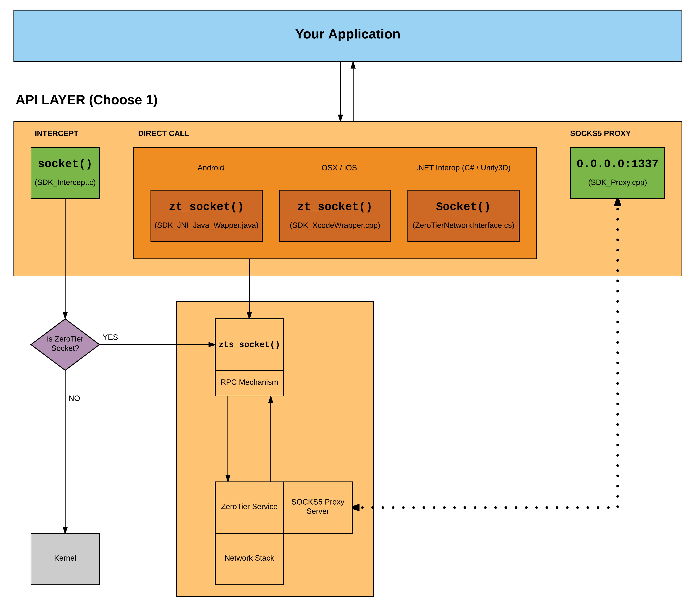

ZeroTier SDK (alpha)
======

ZeroTier-enabled apps. Virtual network access embedded directly into applications and games.

## What does it do?

Imagine starting an instance of your application or game and having it automatically be a member of your virtual network without having to rewrite your networking layer.

## How is it used?

There are generally two ways one might want to use the service. 

 - The first approach is a *compile-time static linking* of our service directly into your application. With this option you can bundle our entire functionality right into your app with no need to communicate with a service externally, it'll all be handled automatically. This is most typical for mobile applications, games, etc.

 - The second is a service-oriented approach where our network call "intercept" is *dynamically-linked* into your applications upon startup and will communicate to a single ZeroTier service on the host. This can be useful if you've already compiled your applications and can't perform a static linking.

## Build instructions

Check out our [Integrations](integrations/) to learn how to integrate this into your application.

## How does it work?

We've built a special background service that pairs the ZeroTier protocol with a user-space [Lightweight IP (lwIP) stack](http://savannah.nongnu.org/projects/lwip/) to create a new way for you to bring your applications onto your virtual network. For a more in-depth explanation of our technology take a look at our [SDK Primer](docs/zt_sdk_primer.md)

## APIs

**Hook/Intercept**
- Uses dynamic loading of our library to allow function interposition or "hooking" to re-implement traditional socket API functions like `socket()`, `connect()`, `bind()`, etc.

**SOCKS5 Proxy**
- Provides an integrated SOCKS5 server alongside the ZeroTier service to proxy connections from an application to resources on a ZeroTier network. For instance, a developer which has built an iOS app using the NSStreams API could add ZeroTier to their application and simply use the SOCKS5 support build into NSStreams to reach resources on their network. An Android developer could do the same using the SOCKS5 support provided in the `Socket` API.

**Direct Call**
- Directly call the `zt_` API specified in [SDK.h](src/SDK.h). For this to work, just use one of the provided headers that specify the interface for your system/architecture and then either dynamically-load our library into your app or compile it right in. 

***

