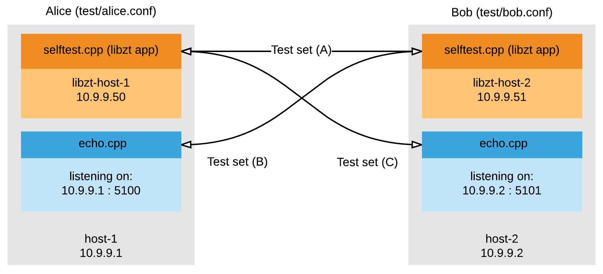

## Testing via [selftest.cpp](test/selftest.cpp)

### Enabling debug output

 - `SDK_DEBUG=1`: For debugging libzt
 - `ZT_DEBUG=1`: For debugging the ZeroTier core protocol

After building the static library, you can run:

 - `make tests`

 This will output `selftest` to `build/$PLATFORM/`. Using this, you can run the tests below. Note, the following examples assume your testing environment is `linux`, you'll see this in the build output path. If this is not true, change it to `darwin`, `freebsd`, or `win` depending on what you're running.

 Simply add your `host-1` and `host-2` address, port, and network information to `test/alice.conf` and `test/bob.conf`, this way you can use the selftest shorthand shown below. The file contain examples of what you should do.

Build outputs are as follows:

```
build
 |
 |--darwin
 |  |-libzt.a
 |  |-selftest
 |  |-echotest
 |
 |--linux
 |  |-libzt.a
 |  |-selftest
 |  |-echotest
 |
 |--freebsd
 |  |-libzt.a
 |  |-selftest
 |  |-echotest
 |
 |--win
    |-libzt.a
    |-selftest
    |-echotest
```

The self test will be performed over the network in the following configuration (addresses and ports are subject to change depending on what you define in your `test/*.conf` files):


### Test sets:
 
 - Test set A: Tests for correctness, error handling, blocking behaviour, on-system performance, etc
 - Test set B: Tests RX performance (from non-libzt app)
 - Test set C: Tests TX performance (to non-libzt app)

### Types of tests (defined in `selftest.cpp`)

#### Simple Tests:

 - Simple tests merely test one aspect of the library. For instance, its role as an IPv4 server, or IPv6 client.

#### Sustained Tests

 - Sustained tests will test the library's ability to support long-duration connections and data transfers.

#### Slam Tests

 - Slam tests will test the library's ability to handle many repeated API calls or repeated common sequences of API calls that a typical application may make. For instance, it will try to create as many sockets as possible, or try to create a socket, bind to an address, listen, and accept over and over. This is useful for detecting memory leaks and architectural limitations in the stack drivers.

#### Comprehensive Tests

 - A comprehensive test will test each aspect of the library one time.

#### Random Tests

 - Makes random API calls with random (or plausible arguments/data) to test for proper error handling

#### Performance Tests

 - Test's the library's performance characteristics

#### Correctness Tests
 
 - Tests's the library's error handling, address treatment, and blocking/non-blocking behaviour.
