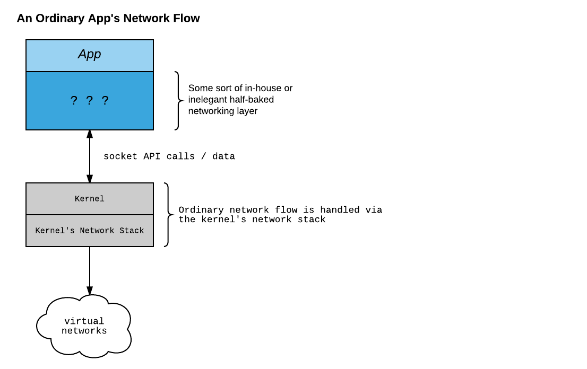
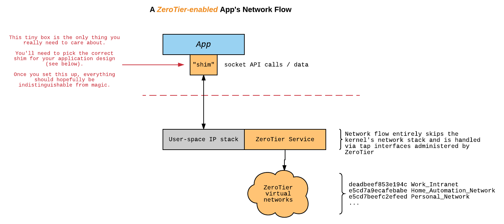
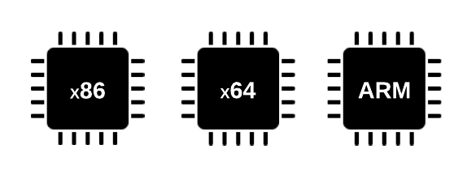
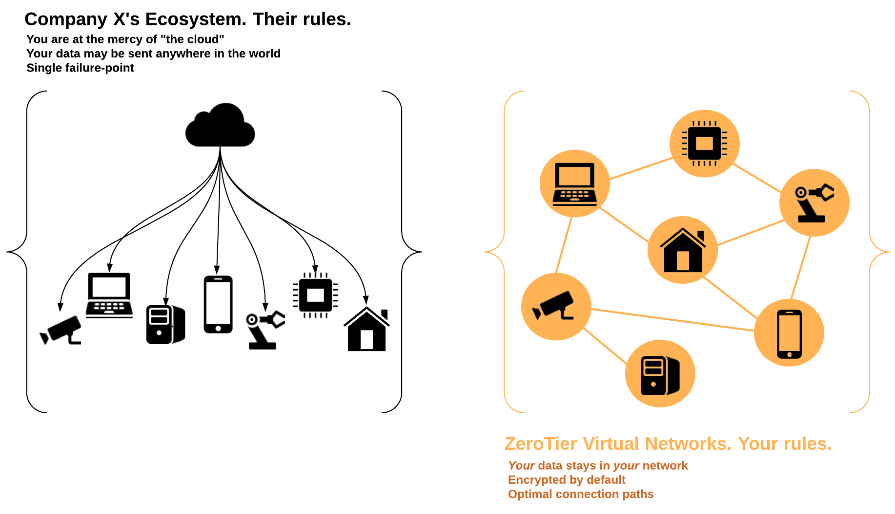

# ZeroTier SDK Primer

True P2P injected right into your app with little to no code changes! A ZeroTier-enabled app. 
(formerly known as Network Containers)

The SDK couples the ZeroTier core Ethernet virtualization engine with a user-space TCP/IP stack and a carefully-crafted "shim" which intercepts and re-directs network API calls to our service. This allows servers and applications to be used without modification or recompilation. It can be used to run services on virtual networks without elevated privileges, special configuration of the physical host, kernel support, or any other application specific configuration. It's ideal for [containerized applications](../integrations/docker), [games](../integrations/Unity3D), and [desktop/mobile apps](../integrations).

Your only responsibility is to pick a shim appropriate for your app's design. Accessing resources (potentially other instances of your app) on the virtual network will work exactly as it would on a real LAN. The service supports both TCP and UDP. The ZeroTier SDK now works on both *x64* and *ARM* architectures. We've tested a beta version for *iOS*, *Android*, *Linux*, and *Mac OS*

The general idea is this:
	1) Your application starts.
	2) The shim and ZeroTier service initializes inside a separate thread of your app.
	3) Your app can now reach anything on your virtual network via normal network calls.

It's as simple as that!

***

More discussion can be found in our [original blog announcement](https://www.zerotier.com/blog/?p=490) and [the SDK product page](https://www.zerotier.com/product-netcon.shtml).
If you have any feature or support requests, be sure to let us know [here](https://www.zerotier.com/community/)!

Combine this functionality with the network/device management capabilities of [ZeroTier Central](https://my.zerotier.com) and its associated [API](https://my.zerotier.com/help/api) and we've hopefully created a simple and reliable way for you to flatten and reduce the complexity of your app's networking layer.

In addition, since this connectivity is mediated over the ZeroTier protocol, you get a free layer of encryption by default. That being said, we still suggest you add your own security layer to match your responsibilities.

***
## What's happening under the hood?

Suppose you write an application that uses sockets to make a connection to some remote server. Normally in order to access resources on a virtual network you'll need to develop some sort of networking layer internally within the app or employ some external software and establish a system-wide connection. Here's an example of how network flow would be handled in this case:

As you can see, your app's logic somehow interacts with a networking layer, the calls then would go to the system and eventually interact with the kernel's network stack. 

Now suppose you've added a ZeroTier shim to your app, since our shim will intercept the network calls we can actually define new behaviour for them. Here's an example of how network flow would be handled for a ZeroTier-enabled app:

For instance, after you've added one of our shims to your app, when your applcation attempts to establish a connection over a socket the following happens:

- application calls `socket()`
- our library's `zt_socket()` is executed instead
-  library establishes an `AF_LOCAL` socket connection with the service (this is used to orchestrate communication between the library and the ZeroTier service)
- an `RPC_SOCKET` message is sent to the ZeroTier tap service
- the tap service receives the `RPC_SOCKET` message and requests a new `tcp_pcb` representing the new "socket" from lwIP
- If the user-space network stack grants the tap service the new `tcp_pcb`, the tap service then repurposes the socket used for the RPC message and returns its file descriptor to your application for it to use as the new socket.

From your application's perspective nothing out of the ordinary has happened. It called `socket()`, and got a file descriptor back.

#### You might be wondering some of the following:
- **What would happen if you attempted to create a socket of the `AF_LOCAL` variety?**
  - Our library will ignore it and pass the call to the system's normal `socket()` implementation since it isn't meant to leave the machine.
- **What would happen if you performed a `getsockopt()` for the family/domain of an `AF_INET` socket you requested?** 
  - You'd expect this should return `AF_LOCAL` since we repurposed the unix-domain socket, right? Nope. We've got a special implementation of `getsockopt()` which will detect whether that socket is handled under the ZeroTier tap service and if it is, it'll lie to you about the socket domain/family and report `AF_INET`. 

We've got a [special implementation](../src/SDK_Sockets.c) for most of the socket API functions: `zt_setsockopt(), zt_getsockopt(),zt_socket(),zt_connect(),zt_bind(),zt_accept4(),zt_accept(),zt_listen(),zt_close(),
zt_getsockname()`. Each shim is implemented in terms of this set of core functions and has the ability to determine whether the call should be directed to the system or the ZeroTier tap service.

## Embedded Applications / IoT

We foresee the largest application of the ZeroTier SDK to be embedded devices that require lightweight, efficient and reliable networking layers that are also secure and effortless to provision. We've specifically engineered the core service and the shims to be as lightweight and portable as possible. We'd like to see people retake control of their data and security by skipping the the "cloud" without adding complexity.

## Games
We think this solution is well suited for low-latency multiplayer games where reliability and ease of use are important.

The ZeroTier protocol is inherently P2P and only falls back to a relay in the event that your direct link is interrupted. It's in our best interest to automatically find the quickest route for your data and to *not* handle your data. This has the obvious benefits of reduced latency for your game, but also provides you better security and control of your data and reduces our costs. It seems non-sensical to do it any other way. ZeroTier is not a "cloud" that you send all of your data to.

We've just begun work on a native [Unity 3D](https://unity3d.com/) plugin to enable your Unity app to communicate over ZeroTier networks. You can check out our BETA [here](../integrations/Unity3D)
